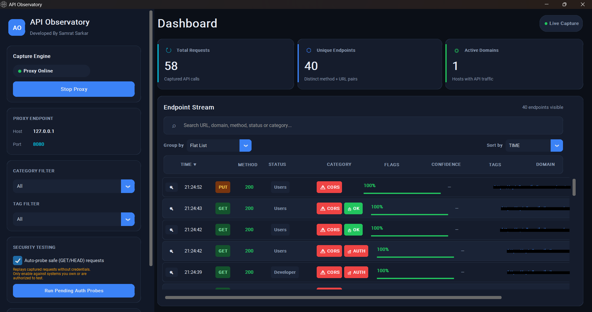
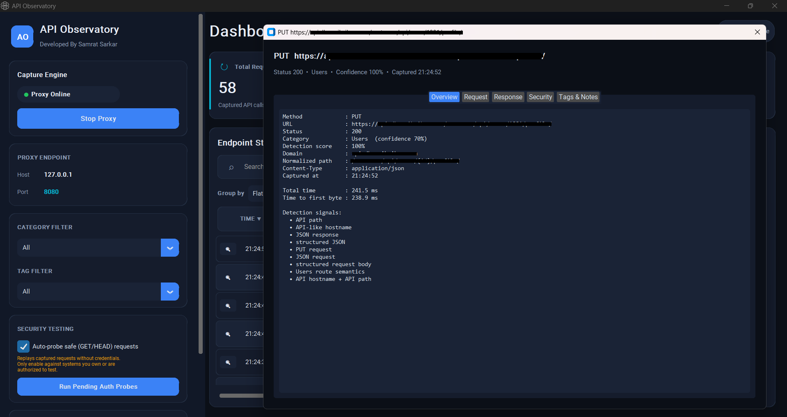

# 🔐 API Observatory

## 📝 Description
API Observatory is a powerful and privacy-focused Windows desktop application designed to help you discover, observe, and analyze API endpoints through browser HTTP and HTTPS traffic. The application works as a local proxy and passively observes network requests, helping security researchers, developers, and API analysts understand how websites communicate with their backend services.

With API Observatory, you can identify API endpoints, inspect request and response information, analyze CORS behavior, classify endpoints, and organize discovered APIs without manually inspecting every network request.

## 📸 Screenshots

### 🖥️ Main Dashboard



### 📋 Endpoint Details



## ✨ Features
- 🔍 API Endpoint Discovery: Automatically detect and identify API endpoints from browser traffic
- 🌐 HTTP/HTTPS Traffic Observation: Passively observe browser requests through a local proxy
- 🎯 Confidence Scoring: Assign confidence levels to detected API endpoints
- 🧭 Endpoint Classification: Categorize discovered endpoints based on observed traffic and behavior
- 📡 HTTP Method Detection: Identify HTTP methods such as GET, POST, PUT, PATCH, DELETE, HEAD, and OPTIONS
- 📊 Status Code Analysis: Inspect HTTP response status codes associated with discovered endpoints
- 🏷️ Tags and Notes: Organize endpoints with custom tags and notes
- 🔎 Search and Filtering: Quickly find specific endpoints across captured traffic
- 📁 Domain and Path Grouping: Organize discovered APIs by domain and normalized URL path
- 📋 Request and Response Inspection: Examine headers, parameters, request bodies, and response information
- 🛡️ CORS Analysis: Inspect Cross-Origin Resource Sharing behavior for observed endpoints
- 🔐 Authentication Boundary Testing: Optionally test authentication boundaries using safe HTTP methods
- 📤 JSON Export: Export discovered API information for further analysis
- 💾 Local Storage: Keep application settings and collected information on your local device
- 🔒 Privacy Focused: Traffic processing is performed locally without requiring a cloud service
- 🌓 Modern Interface: Clean desktop interface with dark and light appearance support
- ⚡ Standalone Application: Run the application without installing Python, pip, or development dependencies

## 🚀 Installation

### 📥 Prerequisites
- Windows 10 or later
- Google Chrome, Microsoft Edge, or another browser that supports manual proxy configuration

### ⚙️ Setup
1. Download the latest Windows release from the [Releases](https://github.com/samrat-sarkar/API-Observatory/releases) section.

2. Extract the downloaded ZIP file.

3. Run:
   ```text
   API Observatory.exe
   ```

4. Configure your browser to use the following local proxy:
   ```text
   Address: 127.0.0.1
   Port: 8080
   ```

5. Start browsing the website you are authorized to analyze. API Observatory will observe the traffic passing through the configured proxy and display detected API endpoints.

### 🔐 HTTPS Setup
To observe HTTPS traffic, the browser must trust the local mitmproxy certificate used by API Observatory.

After starting API Observatory and configuring the browser proxy, open:

```text
http://mitm.it
```

Follow the certificate installation instructions for your operating system and browser.

## 💻 Usage

### 🎮 Basic Usage
1. Launch API Observatory
2. Configure your browser to use `127.0.0.1:8080` as the proxy
3. Open the website you are authorized to analyze
4. Browse through the website normally
5. API Observatory will capture and analyze the observed traffic
6. Review the discovered endpoints in the endpoint table
7. Select an endpoint to inspect its request and response details
8. Use search, filtering, grouping, tags, and notes to organize your findings
9. Export your results as JSON when required

### ⚙️ Features in Action
- 🔍 Automatic API endpoint discovery from browser traffic
- 📊 Confidence scoring for detected endpoints
- 🌐 HTTP and HTTPS request observation
- 🧭 Endpoint and domain grouping
- 📡 HTTP method and response status detection
- 🛡️ CORS behavior analysis
- 🔐 Optional authentication boundary testing
- 🏷️ Endpoint tagging and notes
- 📤 JSON report export
- 🔎 Fast endpoint search and filtering

## 🛠️ Technical Details
- Built with Python
- Uses mitmproxy for local HTTP and HTTPS traffic interception
- Uses CustomTkinter for the desktop user interface
- Uses Requests for supported HTTP operations
- Packaged as a standalone Windows executable using PyInstaller
- Local application settings are stored inside the user's Windows application data directory
- No Python installation is required for the released executable
- No pip or additional Python packages are required for end users
- Designed for passive API discovery and traffic analysis

## 🔒 Security Features
- 🔐 Local traffic processing without requiring a remote API analysis service
- 🛡️ Passive observation of browser traffic
- 🔎 API endpoint confidence scoring to reduce irrelevant detections
- 🚦 Safe HTTP methods can be used for optional endpoint probing
- ⚠️ State-changing HTTP methods require explicit user action
- 🔒 Application settings are stored locally on the user's device
- 🚫 No developer-controlled cloud storage is required for normal operation

## ⚠️ Important Notes
- Use API Observatory only on websites and systems you are authorized to test
- HTTPS inspection requires installation and trust of the local mitmproxy certificate
- Authentication boundary testing should only be performed with explicit authorization
- Do not use the application to intercept traffic belonging to systems or users without permission
- Keep your browser and API Observatory installation updated
- The application is intended for security research, API analysis, development, and authorized testing

## 🤝 Contributing
We welcome contributions, suggestions, and improvements to API Observatory.

1. Fork the repository
2. Create your feature branch:
   ```bash
   git checkout -b feature/AmazingFeature
   ```
3. Commit your changes:
   ```bash
   git commit -m "Add some AmazingFeature"
   ```
4. Push to the branch:
   ```bash
   git push origin feature/AmazingFeature
   ```
5. Open a Pull Request

## 👤 Author
- **Samrat Sarkar**
  - LinkedIn: [samratsarkar9999](https://www.linkedin.com/in/samratsarkar9999/)
  - Website: [samratsarkar.in](https://samratsarkar.in/)

## 📞 Support
If you encounter any issues or have questions, please:

1. Check the existing issues
2. Create a new issue with detailed information
3. Include your Windows version and API Observatory version
4. Include relevant error messages or screenshots
5. Make sure sensitive information such as authentication tokens, cookies, API keys, and personal data is removed before submitting logs or screenshots

---

**API Observatory - Discover, Observe, and Analyze APIs 🔍🌐🔐**
